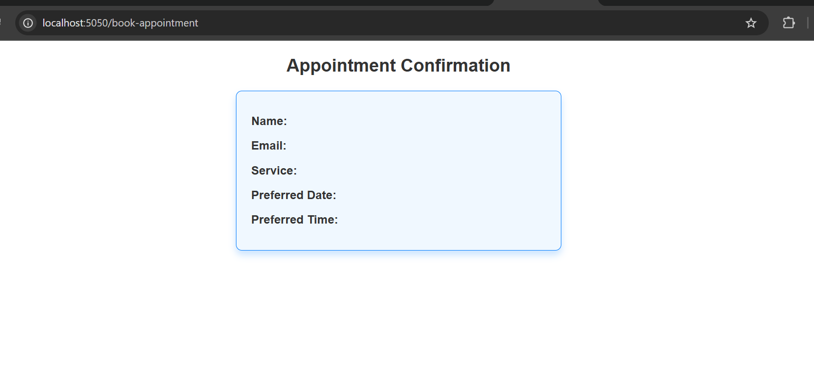
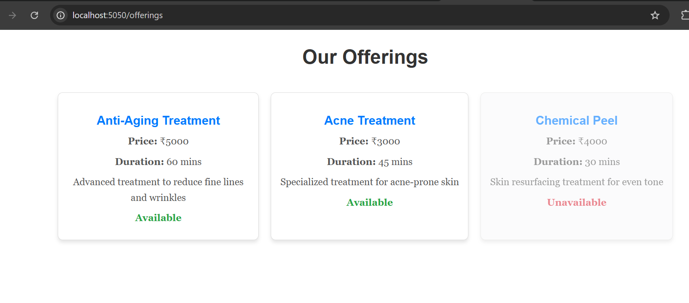
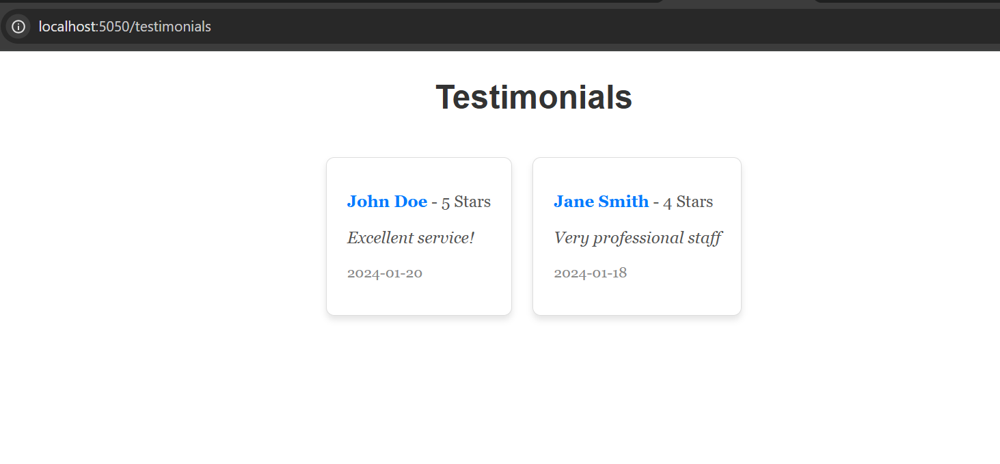

<pre>
<code>
const express = require('express');
const port =  5050
const app = express();
const rateLimit = require('express-rate-limit');

app.use(express.json())

// const limiter = rateLimit({
// 	windowMs: 15 * 60 * 1000, // 15 minutes
// 	limit: 100, // Limit each IP to 100 requests per window (here, per 15 minutes).
// 	standardHeaders: 'draft-8', // draft-6: RateLimit-* headers; draft-7 & draft-8: combined RateLimit header
// 	legacyHeaders: false, // Disable the X-RateLimit-* headers.
// 	// store: ... , // Redis, Memcached, etc. See below.
// })

// app.use(limiter)

let orderList=[
    { id: 1, product: 'Anti-Aging Serum', quantity: 2 },
    { id: 2, product: 'Vitamin C Moisturizer', quantity: 1 },
    { id: 3, product: 'Hyaluronic Acid', quantity: 3 }
]

app.get("/orders/:orderID", (req, res) => {
    const orderID = parseInt(req.params.orderID);
    if (!orderID) {
        return res.status(400).send('Invalid Order ID');
    }
    let order = orderList.find(x => x.id === orderID)
    if (!order) {
        return res.status(404).send('Order not found');
    }
    res.status(200).json({
        success: true,
        message: "Order retrieved successfully",
        order: order
    })
})

app.post("/orders", (req, res) => {
    const { id, product, quantity } = req.body;
    if (!product || !quantity) {
        return res.status(400).send('Product and quantity are required');
    }
    orderList.push({ id, product, quantity });
    res.status(201).json({
        success: true,
        message: "Order created successfully",
        order: { id, product, quantity }
    })
})

let productList = [
    { id: 11, name: "Retinol Serum", price: 1200, availableQty: 50 },
    { id: 12, name: "Niacinamide Solution", price: 800, availableQty: 30 },
    { id: 14, name: "Peptide Moisturizer", price: 1500, availableQty: 100 },
    { id: 15, name: "Glycolic Acid Toner", price: 900, availableQty: 20 }
]

app.get('/', (req, res) => {
    res.send('Welcome to GlowDerma - Your Skincare Journey Begins Here');
})

app.get('/about', (req, res) => {
    res.send('<h3>We are a premium skincare brand committed to bringing you dermatologist-approved, clean beauty products</h3>');
});

const contactDetails = {
    "email": "care@glowderma.com",
    "instagram": "http://instagram.com/glowderma",
    "consultation": "http://glowderma.com/book-appointment"
}

app.get('/contact', (req, res) => {
    res.send(contactDetails);
})

app.get('/products', (req, res) => {
    const { name, maxPrice } = req.query;
    if (!name && !maxPrice) {
        return res.status(200).json(productList);
    }
    let filteredProducts = productList;
    if (name) {
        filteredProducts = filteredProducts.filter(product => product.name === name);
    }
    if (maxPrice) {
        filteredProducts = filteredProducts.filter(product => product.price <= maxPrice);
    }
    return res.status(200).json(filteredProducts);
})

let shoppingCart = []
app.get('/cart', (req, res) => {
    res.status(200).json(shoppingCart);
})

app.post('/cart', (req, res) => {
    const { id, name, price } = req.body;

    if (!id || !name || !price) {
        return res.status(400).json({ "error": "All fields are required" });
    }
    const newItem = { id, name, price };
    shoppingCart.push(newItem);
    res.status(201).json(newItem);
})

app.get('*', (req, res) => {
    res.status(404).json({ "error": "Route not found" })
})

app.listen(port, () => {
    console.log(`Server is running on port ${port}`);
})
</code>
</pre>

**Output:**  

