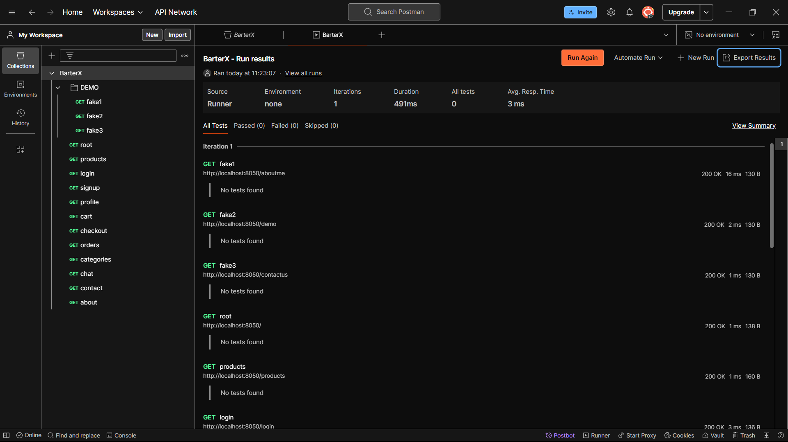

<pre>
<code>
import http from 'http';
import fs from 'fs';
const port = 8050;

const server = http.createServer((req, res) => {
    // res.write(req.url);
    // console.log(req);
    // fs.writeFileSync('./djj.txt',)
    fs.appendFileSync('./log.txt',`Get Request from  ${req.url} by ${req.method} Method at ${new Date()}\n`);
    let uri=req.url
    switch (uri) {
        case '/':
            res.write("Welcome to the BarterX")
            break
        case '/products':  
            res.write("Here are the products up for Sale in BarterX")
            break
        case '/login': 
            res.write( "Login to the BarterX")
            break
        case '/signup': 
            res.write( "Sign up to the BarterX")
            break
        case '/profile': 
            res.write( "Trader Profile")
            break
        case '/cart': 
            res.write( "Your Shopping Cart is here")
            break
        case '/checkout': 
            res.write( "Lets' start shipping")
            break
        case '/orders': 
            res.write( "Your Orders are here")
            break
        case '/categories': 
            res.write( "Browse Categories")
            break
        case '/chat': 
            res.write( "Your Chat with fellow Traders")
            break
        case '/contact': 
            res.write( "Contact Us at")
            break
        case '/about': 
            res.write( "The modern approach to trading our commodities")
            break
        default: 
            res.write( "Page not found")
            res.write( "Error 404")
            break
    // Fzor any other page, the server must display a message "Page not found"
    }
    res.end();
})

server.listen(port,() => {
    console.log("Server initiated on port 8050...");
    console.log("http://localhost:8050/");
})
</code>
</pre>

**Output:**  

 
