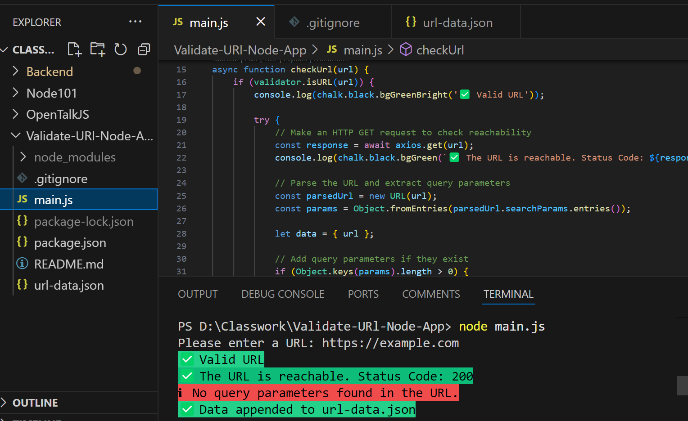

<pre>
<code>
const chalk = require('chalk');
const readline = require('readline');
const validator = require('validator');
const axios = require('axios');
const fs = require('fs');
const { URL } = require('url');

// Create an interface to read input from the terminal
const rl = readline.createInterface({
    input: process.stdin,
    output: process.stdout
});

// Function to validate, check URL, and store details in a JSON file
async function checkUrl(url) {
    if (validator.isURL(url)) {
        console.log(chalk.black.bgGreenBright('✅ Valid URL'));

        try {
            // Make an HTTP GET request to check reachability
            const response = await axios.get(url);
            console.log(chalk.black.bgGreen(`✅ The URL is reachable. Status Code: ${response.status}`));

            // Parse the URL and extract query parameters
            const parsedUrl = new URL(url);
            const params = Object.fromEntries(parsedUrl.searchParams.entries());

            let data = { url };

            // Add query parameters if they exist
            if (Object.keys(params).length > 0) {
                console.log(chalk.black.bgGreenBright('✅ URL contains query parameters:'));
                Object.entries(params).forEach(([key, value]) => {
                    console.log(chalk.black.bgGreen(`   ${key}: ${value}`));
                });
                data.params = params;
            } else {
                console.log(chalk.black.bgRedBright('ℹ️ No query parameters found in the URL.'));
            }

            // Read the existing data from the JSON file
            let fileData = [];
            if (fs.existsSync('url-data.json')) {
                fileData = JSON.parse(fs.readFileSync('url-data.json', 'utf8'));
            }

            // Append the new data to the existing array
            fileData.push(data);

            // Write the updated array back to the file
            fs.writeFileSync('url-data.json', JSON.stringify(fileData, null, 4));
            console.log(chalk.black.bgGreenBright('✅ Data appended to url-data.json'));
        } catch (error) {
            console.log(chalk.black.bgRedBright('❌ The URL is unreachable or blocked.'));
        }
    } else {
        console.log(chalk.black.bgRedBright('❌ Invalid URL'));
    }

    // Close the input stream
    rl.close();
}

// Prompt the user to enter a URL
rl.question('Please enter a URL: ', (url) => {
    checkUrl(url);
});
</code>
</pre>

**Output:**  
