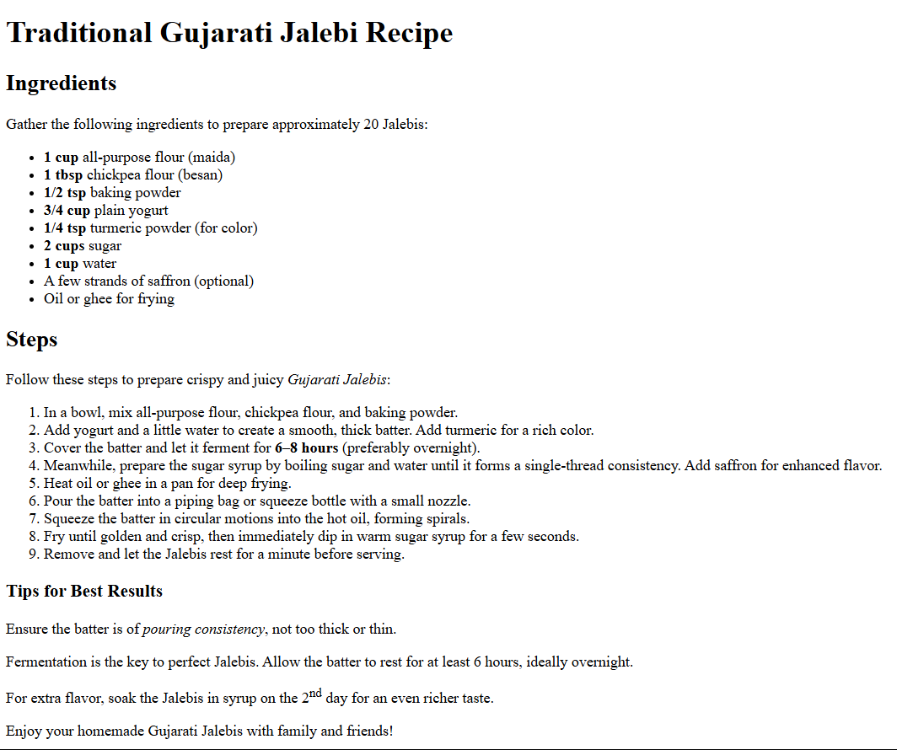
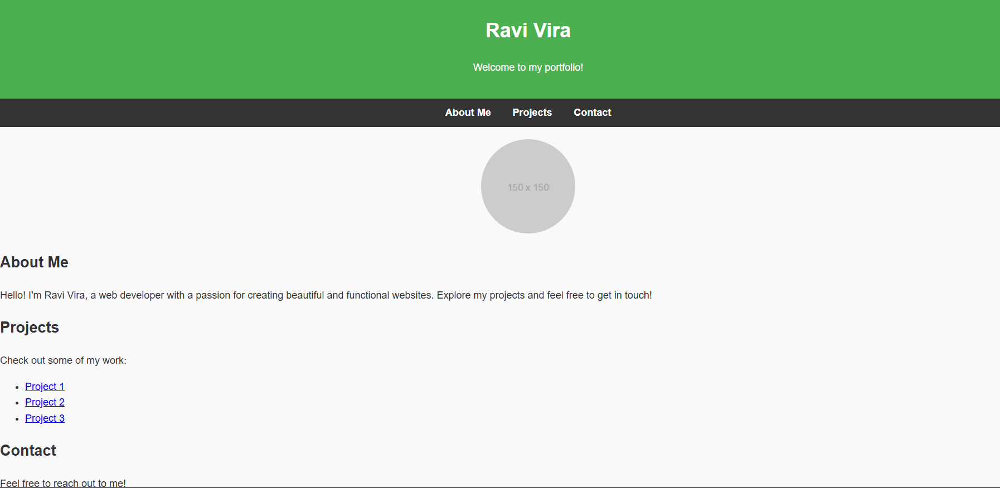
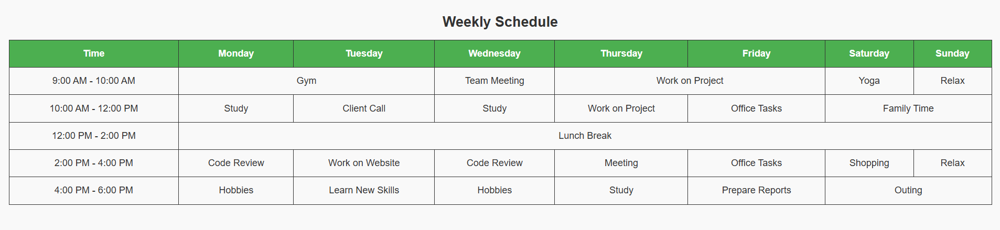
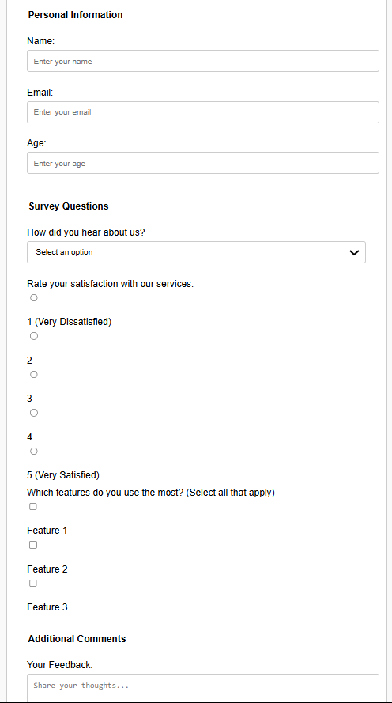

# 📝 Assignment 2 - HTML Questions

## 🔹 Question 1
[View Code](assignment2-q1.html)  
**Output:**  

## 🔹 Question 2
[View Code](assignment2-q2.html)  
**Output:**  

## 🔹 Question 3
[View Code](assignment2-q3.html)  
**Output:**  

## 🔹 Question 4
[View Code](assignment2-q4.html)  
**Output:**  

## 🔹 Question 5
[View Code](assignment2-q5.html)  
**Output:**  

